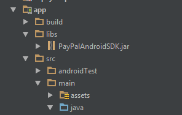

# Paypal integration instruction

## Step 1
Copy library jar files to ‘libs’ folder in the app directory.

 

## Step 2
Declare these activities in your AndroidManifest file:
```java
compile project(':paypaladapter-release')
```
      
## Step 3
Declare these activities in your AndroidManifest file:
```java
<service
   android:name="com.paypal.android.sdk.payments.PayPalService"
   android:exported="false" />

<activity android:name="com.paypal.android.sdk.payments.PaymentActivity" />
<activity android:name="com.paypal.android.sdk.payments.LoginActivity" />
<activity android:name="com.paypal.android.sdk.payments.PaymentMethodActivity" />
<activity android:name="com.paypal.android.sdk.payments.PaymentConfirmActivity" />
<activity
   android:name="io.card.payment.CardIOActivity"
   android:configChanges="keyboardHidden|orientation" />
<activity android:name="io.card.payment.DataEntryActivity" />
```

## Step 4
Initialize an instance of PsPaypal object (after UnifiedRequest object initialization)
```java
UnifiedRequest request = new UnifiedRequest();
request.setPwProjectKey(Constants.PW_PROJECT_KEY);
request.setPwSecretKey(Constants.PW_SECRET_KEY);
...

PsPaypal paypal = new PsPaypal();
paypal.setClientId(Constants.PAYPAL.CONFIG_CLIENT_ID);
paypal.setEnvironment(Constants.PAYPAL.CONFIG_ENVIRONMENT);
paypal.setReceiverEmail(Constants.PAYPAL.CONFIG_RECEIVER_EMAIL);
```

## Step 5
Create an instance of ExternalPs with the above PsPaypal object
```java
ExternalPs paypalPs = new ExternalPs("paypal", "Paypal", R.drawable.ps_logo_paypal, paypal);
```
Add this to the unified request object:
```java
request.add(paypalPs);
```
