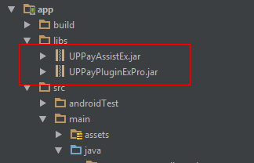

# Unionpay integration instruction

## Step 1
Copy library jar files to ‘libs’ folder in the app directory.

 

## Step 2
Add this line to your app module’s build.gradle file:
```java
compile project(':unionpayadapter-release')
```
      
## Step 3
Declare these activities in your AndroidManifest file:
```java
<activity
   android:name="com.unionpay.uppay.PayActivity"
   android:configChanges="orientation|keyboardHidden|keyboard"
   android:screenOrientation="portrait"></activity>

<activity
   android:name="com.unionpay.UPPayWapActivity"
   android:configChanges="orientation|keyboardHidden|fontScale"
   android:screenOrientation="portrait"
   android:windowSoftInputMode="adjustResize"></activity>
```

## Step 4
Initialize an instance of PsUnionpay object (after UnifiedRequest object initialization)
```java
UnifiedRequest request = new UnifiedRequest();
request.setPwProjectKey(Constants.PW_PROJECT_KEY);
request.setPwSecretKey(Constants.PW_SECRET_KEY);
...

PsUnionpay unionpay = new PsUnionpay();
```

## Step 5
Create an instance of ExternalPs with the above PsAlipay object
```java
ExternalPs unionpayPs = new ExternalPs("unionpay", "Unionpay", R.drawable.ps_logo_unionpay, unionpay);
```
Add this to the unified request object:
```java
request.add(unionpayPs);
```
